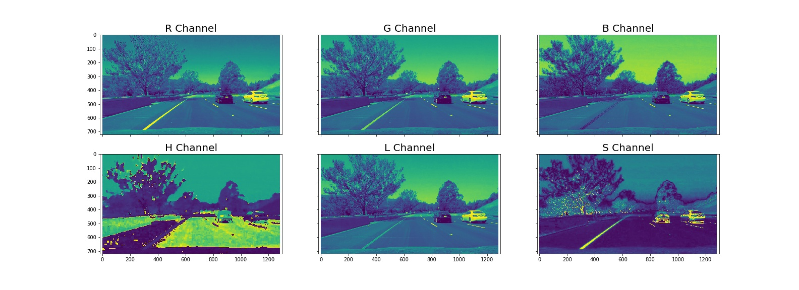
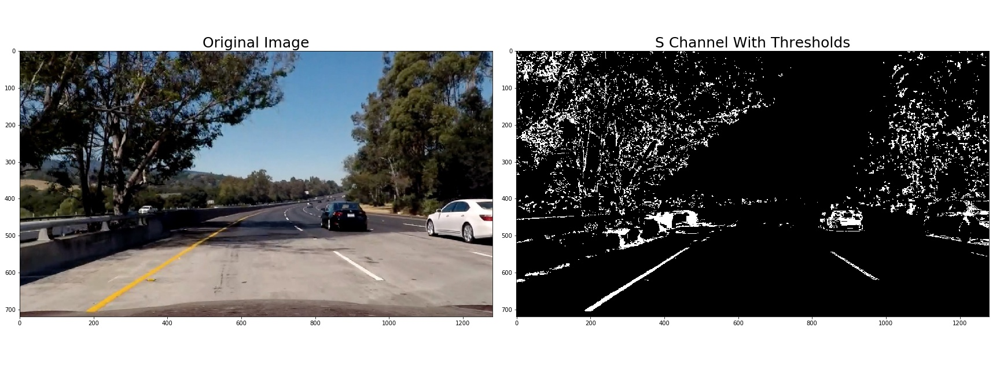
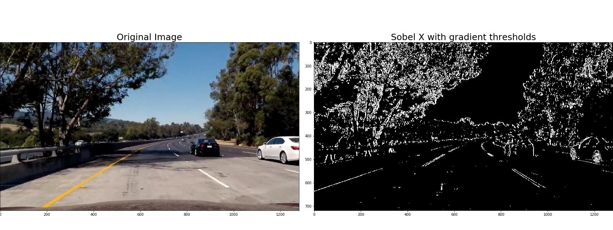
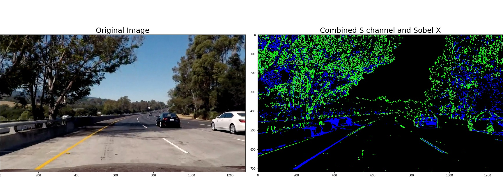
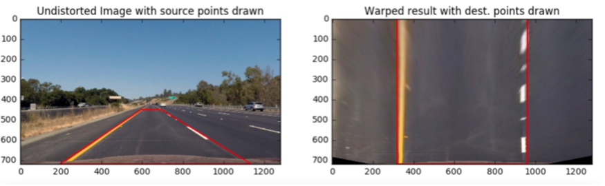
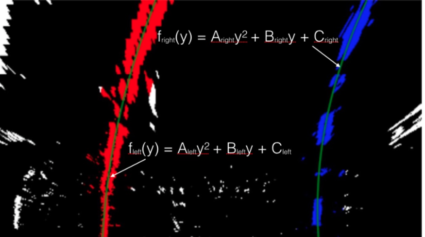
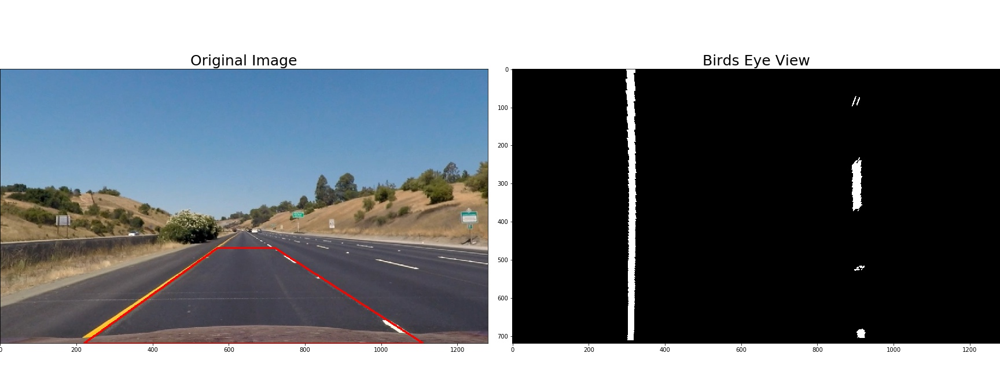
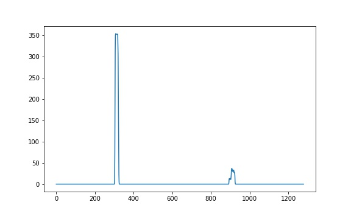
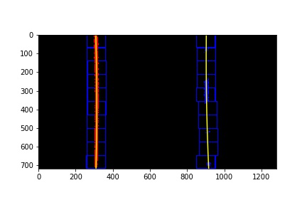
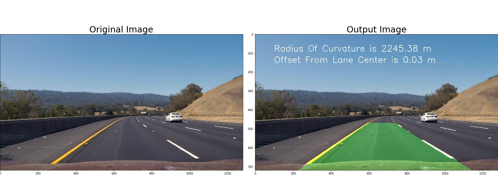

# Advanced Lane Finding Project
Navigating steep curves and varying light conditions!

In the previous article "4 techniques self driving cars can use to find lanes", before applying canny edge detection algorithm, we converted image to grayscale to find edges. By doing so we lost valuable information about colour and lighting conditions, as seen in the below image. 

Hence the need for other techniques that can capture and utilise this additional information.
 

We will look at a few techniques to overcome the above mentioned issues.

## Topics ##

 1. Explore Other Colour Spaces
 2. Lighting Conditions
 3. Steep Curves
 

### Colour Spaces ###

Colour Spaces : RGB works well for white lanes. It does not work well under varying light conditions or when lanes are of a different colour like yellow . Lets explore other colour spaces like HSV (Hue, Saturation, Value) and HLS (Hue, Lightness, Saturation ) etc.

Hue represents colour that is independent of any change in brightness.

Lightness and Value are different ways to measure lightness or darkness of a colour.

Saturation is the measure of colourfulness.

Image with yellow lines was split into RGB and HLS as seen below. 

Only R,G and S channels show high pixel intensities corresponding to yellow lane lines.  Blue channel has zero yellow pixel intensity. 

By choosing the best channel and the right color thresholds for that channel, we can now identify yellow lane lines more accurately, as seen below.

However, the S-channel was not able to detect yellow lane under the shaded area.

### Lighting Conditions ###

Since lanes lines are vertical, we can use gradients in a smarter way to detect steep edges that are more likely to be lanes. 

By choosing the gradient in x direction (Sobel x operator) and adjusting the strength of this gradient, we can now find those parts of the lane, which could not be detected by S-Channel (in the earlier section), as seen below.

We can now combine the pixels identified by each of the above techniques (Sobel x and S- Channel), to find yellow lane lines more accurately, under varying lighting conditions, as seen below.

Even though our algorithm can now detect lanes of different colours and under different lighting conditions, it might still fail, when it encounters sudden curves.

### Steep Curves ###

 A Self driving car needs to know the lane curvature, apart from speed and car dynamics, to determine the steering angle necessary to stay in the lane.

 
 
 To know lane curvature, you need to map lanes from a different perspective (Birds eye view : look from above).

Birds eye view, lets us fit a polynomial to the lane lines. We then extract line curvatures from the polynomial.

#### Find Left and Right Lanes ####

Plotting the histogram and finding the peaks in left and right halfs of the above image, gives starting positions of left and right lanes as shown below.

Using the starting positions, and applying sliding window technique on the image, we are able to fit polynomial to the lane lines as shown below.

Pixels were converted to meters and polynomial fit was recomputed to determine, radius of curvature in meters, as seen below.

## Results ##

By taking advantage of the fact that consecutive frames have lane lines at similar position,to find lane pixels in the next frame, we can search around the previously detected lane line positions with-in a certain margin.

Application of the above techniques resulted in the car accurately identifying lanes of different colours, under varying lighting conditions and at steep curves, as shown in the video below. 
 

### Acknowledgements ###
Sincere thanks to udacity. The final video is the output of my Advanced lane finding project, of the udacity self driving car nanodegree.

